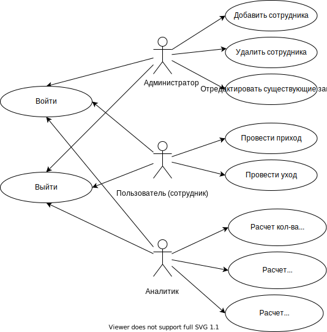

# ППО 2022. Pet-проект

<!-- vscode-markdown-toc -->
* 1. [ Название проекта](#)
* 2. [ Краткое описание идеи проекта](#2)
* 3. [ Краткое описание предметной области](#3)
* 4. [Краткий анализ аналогичных решений по 3 критериям](#4)
* 5. [Краткое обоснование целесообразности и актуальности проекта](#5)
* 6. [Use-Case - диаграмма](#Use-Case)
* 7. [ER-диаграмма сущностей](#ER)
* 8. [Архитектурные характеристики, важные для проекта](#8)

<!-- vscode-markdown-toc-config
	numbering=true
	autoSave=true
	/vscode-markdown-toc-config -->
<!-- /vscode-markdown-toc -->

##  1.  Название проекта

Система учета автомобилей для автосалона

##  2.  Краткое описание идеи проекта

Необходимо спроектировать и реализовать базу данных, содержащую данные об автомобилях и их владельцах, данные автосалона для учета этих автомобилей. А так же производить сам учет.

##  3.  Краткое описание предметной области

В проект входят база данных, программный и пользовательский интерфейсы.

База данных содержит данные об автомобилях и их
 владельцах, и данные автосалона для учета этих автомобилей. Программный
интерфейс приложения (API) включает в себя функции для работы с этой базой данных: добавлять, удалять и
редактировать информацию об автомобилях другим программным компонентам системы управления базой данных.

##  4.  Краткий анализ аналогичных решений по 3 критериям

| Критерий \ Решение |Хранить в файле | Хранить в базе данных | Система учета|
|----------------|:---------:|:---------:|----------------:|
| Доступ к данным | + |+ | + |
| Быстродействие | - | - |+ |
| Журналирование | - | + |+ |

##  5.  Краткое обоснование целесообразности и актуальности проекта

В наше время на автомобили есть спрос. Он обусловлен комфортом и легкостью передвижения на данном транспортном средстве.
У каждого автосалона имеются данные об автомобилях, которые ему поставляются.
Так как автомобилей много, для хранения данных о них требуется база данных. Чтобы эффективно производить учет автомобилей автосалона, необходмо иметь систему такого учета. 

Таким образом, исходя из вышеприведенного сравнения имеющихся решений и изложенного рассуждения, предложенное решение является актуальным. 

##  6.  Use-Case - диаграмма

##  7.  ER-диаграмма сущностей

##  8.  Архитектурные характеристики, важные для проекта

Тип приложения - Desktop.

Технологический стек: C#, PostgreSQL, Docker.
